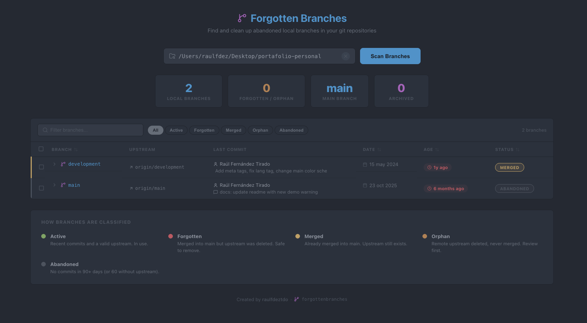

<!-- PROJECT SHIELDS -->
[![Contributors][contributors-shield]][contributors-url]
[![Forks][forks-shield]][forks-url]
[![Issues][issues-shield]][issues-url]
[![License][license-shield]][license-url]
[![Release][release-shield]][release-url]

<!-- PROJECT LOGO -->
<br />
<div align="center">
  <h1>
    
    Forgotten Branches
  </h1>

  <p align="center">
    Encuentra y limpia ramas locales olvidadas en tus repositorios git.
    <br />
    <a href="#uso"><strong>Explorar la documentación »</strong></a>
    <br />
    <br />
    <a href="https://github.com/raulfdeztdo/forgottenbranches/issues">Reportar Bug</a>
    ·
    <a href="https://github.com/raulfdeztdo/forgottenbranches/issues">Solicitar Funcionalidad</a>
  </p>

  <p align="center">
    
    
    
    
    
    
    
  </p>

  <br />
  
</div>

<!-- TABLE OF CONTENTS -->
<details open>
  <summary>Tabla de contenidos</summary>
  <ol>
    <li><a href="#sobre-el-proyecto">Sobre el proyecto</a></li>
    <li><a href="#plataformas-soportadas">Plataformas soportadas</a></li>
    <li>
      <a href="#primeros-pasos">Primeros pasos</a>
      <ul>
        <li><a href="#prerrequisitos">Prerrequisitos</a></li>
        <li><a href="#instalación">Instalación</a></li>
        <li><a href="#actualizar">Actualizar</a></li>
      </ul>
    </li>
    <li><a href="#uso">Uso</a></li>
    <li><a href="#funcionalidades">Funcionalidades</a></li>
    <li><a href="#desarrollo">Desarrollo</a></li>
    <li><a href="#cómo-funciona">Cómo funciona</a></li>
    <li><a href="#licencia">Licencia</a></li>
    <li><a href="#contacto">Contacto</a></li>
  </ol>
</details>

## Sobre el proyecto

Muchas veces se suben ramas a producción, se mergean y se quedan abandonadas en local sin que nadie las borre. Con el tiempo se acumulan decenas de ramas que ensucian el output de `git branch` y dificultan el día a día.

**Forgotten Branches** escanea cualquier repositorio git, analiza cada rama local y te dice cuáles son seguras de eliminar, cuáles es mejor archivar y cuáles están activas. Todo desde una interfaz web que se abre sola al ejecutar un comando.

### ¿Por qué esta herramienta?

- **Sin depender de un servidor** — Todo se ejecuta en local, sin conexión externa.
- **Clasificación inteligente** — No solo lista ramas: las clasifica según su estado real (mergeadas, huérfanas, abandonadas...).
- **Archivado** — Guarda el historial de ramas que ya no necesitas sin perder la referencia.
- **Borrado en masa** — Limpia decenas de ramas en segundos.

## Plataformas soportadas

- **macOS**
- **Linux**
- **Windows con WSL**

## Primeros pasos

### Prerrequisitos

- [Node.js](https://nodejs.org) 18 o superior
- [pnpm](https://pnpm.io) 9 o superior (`npm install -g pnpm`)
- [Git](https://git-scm.com) 2.30 o superior

### Instalación

```bash
git clone https://github.com/raulfdeztdo/forgottenbranches.git
cd forgottenbranches
./install.sh
```

El script instala las dependencias, compila el proyecto y registra el comando `forgottenbranches` de forma global. También añade un acceso directo en el menú de aplicaciones del sistema.

### Actualizar

```bash
./update.sh
```

Hace `git pull`, reinstala dependencias si hay nuevas y recompila. Si ya estás en la última versión te lo indica sin hacer nada.

## Uso

```bash
# Abrir la aplicación
forgottenbranches

# Abrir y escanear un repo directamente
forgottenbranches /home/usuario/proyectos/mi-app
```

Al abrirse el navegador, pegas la ruta de un repositorio git, pulsas **Scan Branches** y la aplicación muestra cada rama local con todos sus detalles.

### Estados de las ramas

| Estado | Color | Significado |
|--------|-------|-------------|
| **Active** | 🟢 | Actividad reciente, en uso |
| **Forgotten** | 🔴 | Mergeada en main + upstream borrado del remoto |
| **Orphan** | 🟠 | Upstream borrado del remoto, sin mergear |
| **Merged** | 🟡 | Ya está en main, upstream sigue vivo |
| **Abandoned** | ⚪ | Sin actividad en +90 días (o +60 sin upstream) |

## Funcionalidades

- **Análisis completo por rama** — nombre, upstream, último commit (hash, autor, fecha, mensaje), antigüedad, último checkout del reflog.
- **Información de merge** — qué commit la mergeó en main, cuándo y con qué mensaje.
- **Panel de detalle desplegable** — clic en cualquier rama para ver todos los datos.
- **Eliminar ramas** — individual o en masa, con borrado seguro (`-d`) o forzado (`-D`).
- **Archivar ramas** — crea un tag anotado `archive/<nombre>` y borra la rama local. La rama desaparece de `git branch` pero se puede recuperar.
- **Desarchivar** — restaura la rama desde el tag de archivo.
- **Selección múltiple** — checkboxes en cada fila con barra de acciones para operar sobre varias ramas a la vez.
- **Historial de proyectos** — las rutas escaneadas se guardan en `localStorage` y aparecen como sugerencias al hacer foco en el campo de búsqueda.
- **Filtros** — por nombre de rama y por estado mediante pills interactivas.
- **Ordenación** — por nombre, fecha de commit, antigüedad o estado (por defecto: activas primero).

## Desarrollo

```bash
# Instalar dependencias (workspaces server + client en un solo comando)
pnpm install

# Iniciar servidores de desarrollo (Express :3001 + Vite :5173)
pnpm run dev

# Compilar para producción
pnpm run build
```

El backend escucha en `localhost:3001` y el frontend en `localhost:5173` con proxy de Vite hacia la API.

## Cómo funciona

```
┌─────────────┐     ┌──────────────┐     ┌───────────┐
│  React UI   │────▶│  Express API │────▶│  git CLI  │
│  (Vite)     │◀────│  (Node.js)   │◀────│  (local)  │
└─────────────┘     └──────────────┘     └───────────┘
```

El backend Express ejecuta comandos `git` directamente sobre tus repositorios locales usando `child_process`. El frontend React muestra los resultados en una interfaz con tema One Dark Pro. En producción, un solo proceso Node.js sirve tanto la API como el frontend compilado — no necesitas arrancar dos procesos.

Todo ocurre en tu máquina. No se envía ningún dato al exterior.

## Licencia

Distribuido bajo la licencia MIT. Ver `LICENSE` para más información.

## Contacto

Raúl Fernández Tirado — [@raulfdeztdo](https://github.com/raulfdeztdo)

Repositorio: [https://github.com/raulfdeztdo/forgottenbranches](https://github.com/raulfdeztdo/forgottenbranches)

<!-- MARKDOWN LINKS & IMAGES -->
[contributors-shield]: https://img.shields.io/github/contributors/raulfdeztdo/forgottenbranches.svg?style=for-the-badge
[contributors-url]: https://github.com/raulfdeztdo/forgottenbranches/graphs/contributors
[forks-shield]: https://img.shields.io/github/forks/raulfdeztdo/forgottenbranches.svg?style=for-the-badge
[forks-url]: https://github.com/raulfdeztdo/forgottenbranches/network/members
[issues-shield]: https://img.shields.io/github/issues/raulfdeztdo/forgottenbranches.svg?style=for-the-badge
[issues-url]: https://github.com/raulfdeztdo/forgottenbranches/issues
[license-shield]: https://img.shields.io/github/license/raulfdeztdo/forgottenbranches.svg?style=for-the-badge&cacheSeconds=0
[license-url]: https://github.com/raulfdeztdo/forgottenbranches/blob/main/LICENSE
[release-shield]: https://img.shields.io/github/v/release/raulfdeztdo/forgottenbranches?style=for-the-badge&color=purple
[release-url]: https://github.com/raulfdeztdo/forgottenbranches/releases/latest
